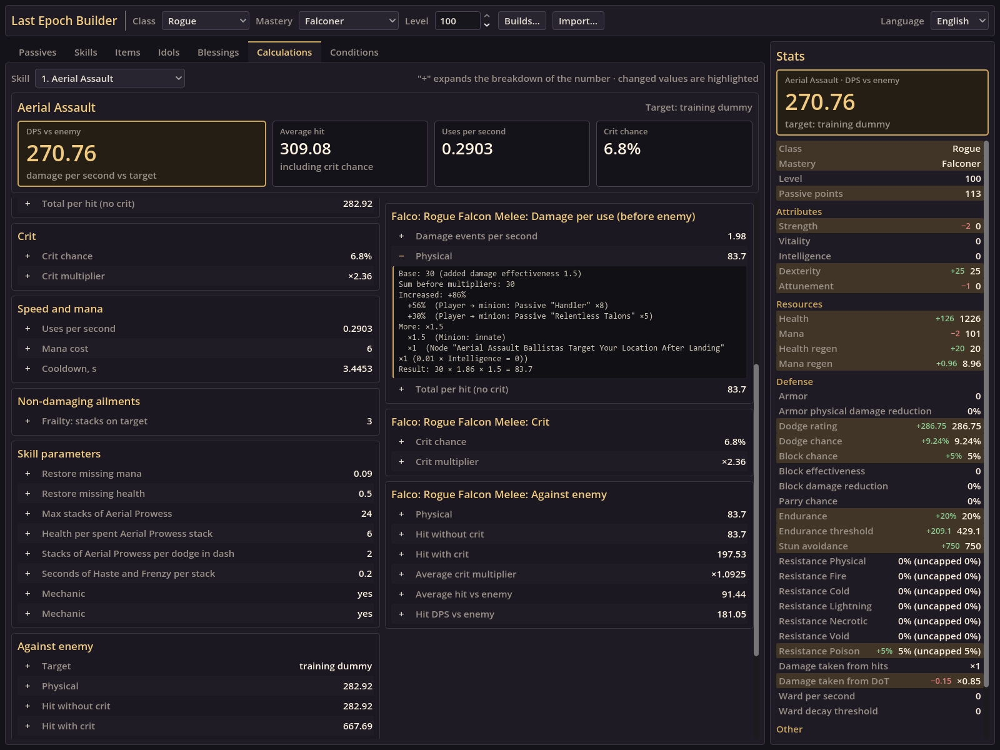
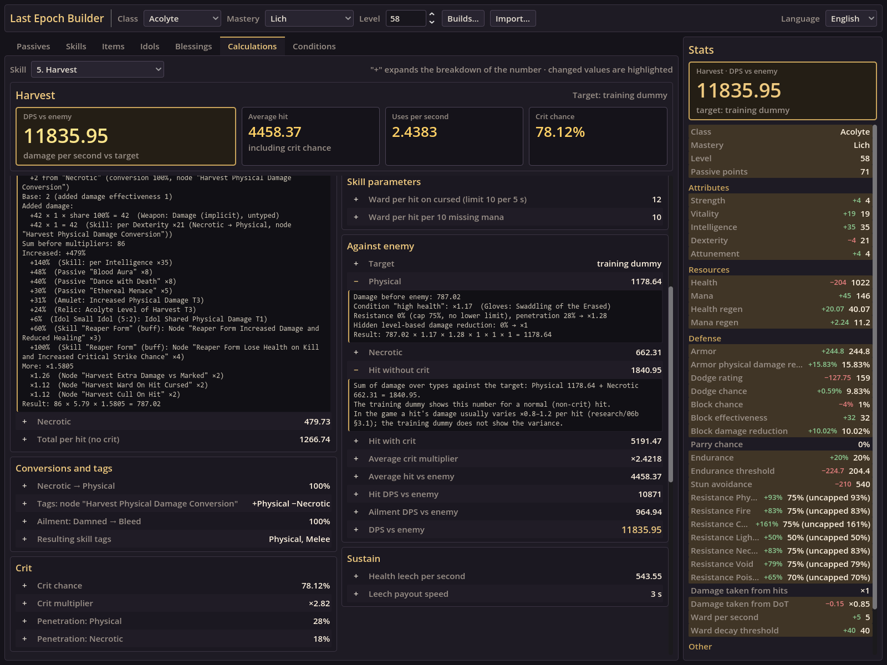
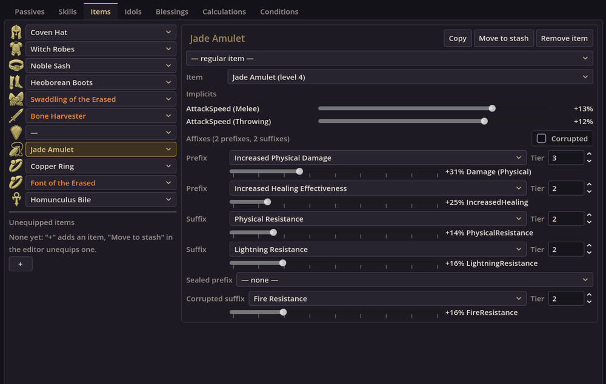

# Last Epoch Builder

## [▶ Open Last Epoch Builder in the browser](https://weksil.github.io/LastEpochBuilder/)

Runs in any desktop browser with WebGL 2, no installation; saved builds stay in that browser.

A build planner for Last Epoch in the spirit of Path of Building: exact numbers with a breakdown of every value, items,
idols, blessings, skill and passive trees, player and enemy conditions. Game version: **1.5.0 (Season 5)**.
Interface in English or Russian. Ctrl+Z undoes a build edit, Ctrl+Shift+Z (or Ctrl+Y) redoes it.

## Import a character

Press **Import…** in the top bar, enter your Last Epoch account name, press **Find characters** and pick a character.
Characters are read from the account's [Maxroll](https://maxroll.gg/last-epoch) profile, so the profile must be public.
Class, mastery, level, passives, skills with their trees, items, idols with the altar and blessings are loaded (the Weaver
tree is not imported yet). The current build is replaced.

To share a build made in Last Epoch Builder, use **Builds… → Copy code**; the other person presses **Paste code** in the same dialog, then **Load**.

## Loot filter for the build

**Loot filter…** in the top bar makes a Last Epoch loot filter from the build: the bases of your items with the affixes you
want to craft, exalted items with those affixes (also for legendary crafting), your idols, uniques and set items; everything
else of normal, magic and rare rarity is hidden. Uncheck what you do not need, press **Download .xml** and put the file into
`%USERPROFILE%\AppData\LocalLow\Eleventh Hour Games\Last Epoch\Filters`, then pick the filter in the game.

## What it shows

### Minion damage

Open **Calculations** and pick a skill that summons or uses minions (here the Falconer's Aerial Assault). Every minion attack
is its own damage component with damage per use, crit and damage against the enemy; the skill's DPS includes them.
Press **+** next to a number to see where it comes from: the minion's base damage, the player stats transferred to the
minion ("Player → minion"), the minion's innate modifiers and the skill tree nodes.

### Exact skill numbers

**Calculations** shows the selected skill: DPS against the enemy, average hit, uses per second, crit chance, then
sections for damage per use, conversions and tags, crit, speed and mana, ailments, skill parameters from the tree,
damage against the enemy (hit without and with a crit, as on the training dummy) and sustain. Each **+** expands the full
breakdown: base damage, every "added", "increased" and "more" modifier with its source (passive, item, idol, tree node,
buff), the enemy's resistances and penetration. What the planner does not model is listed in **Not counted** at the bottom.
The target and its state are set in **Conditions**.

### Effective health against bosses

**Defense** runs one enemy attack through your defenses, like "Maximum hit taken" and "Total EHP" in Path of Building.
Pick the average monster of a level 100 monolith (melee, ranged, spell, damage over time or a hit with every damage type),
an attack of a monolith timeline end boss or a pinnacle boss (Aberroth, Uber Aberroth, Morditas, Majasa, the Observer…),
or type a custom hit. The attack is scaled to the area level and the corruption, then the tab shows your
effective health, the maximum hit you survive, hits to die and the share of damage you take, with the breakdown of every
layer: resistances against the enemy's area penetration, armor, damage taken, dodge, parry, glancing blow, block, enemy crits,
ward, endurance and mana before health, dodge and block conversions, conditional defenses and damage taken as another type.
Regeneration, ward, leech and on-hit recovery between hits are counted too. It warns when the worst roll of the attack kills
you from full health.

### Stat diff while editing an item

Open **Items**, pick a slot and change the item: base, implicit rolls, affixes and their tier/roll sliders. Edits stay a
draft until **Save**; under the item the editor shows what saving would change — DPS of the selected skill against the
enemy and every character stat — live while a slider moves. **Discard changes** drops the edits. Hovering an item in a slot
dropdown shows the same diff for equipping it. Idols and blessings have the same diff.

## License

The code and documentation are distributed under the [MIT license](LICENSE).

Last Epoch is a trademark of Eleventh Hour Games. This project is not affiliated with or endorsed by Eleventh Hour Games.
The game data, texts and art extracted from the Last Epoch client (`research/data/game/`, `research/02_assets/`,
`client/assets/`) belong to Eleventh Hour Games and are included only so that the planner works; the MIT license does not
cover them. The `client/addons/godot_ai` plugin has its own MIT license.

Developer documentation (formula sources, architecture, tests, web build): [TECH_README.md](TECH_README.md).
